# Тема 4. DML та DDL команди. Складні SQL вирази

Коротко: створити базу даних для керування бібліотекою, заповнити тестовими
даними та написати складні SQL запити з використанням JOIN операторів.

## Опис домашнього завдання

У цьому домашньому завданні застосовано знання з мови SQL для створення та
роботи з базою даних. Завдання охоплює визначення структури таблиць за допомогою
DDL-команд, наповнення їх тестовими даними за допомогою DML-команд, а також
написання складних запитів з використанням декількох операторів JOIN для
об'єднання таблиць.

---

## 1. Створення бази даних бібліотеки

Схема `LibraryManagement` із п'ятьма таблицями:

- **authors**: `author_id` (INT, PK, AUTO_INCREMENT), `author_name` (VARCHAR)
- **genres**: `genre_id` (INT, PK, AUTO_INCREMENT), `genre_name` (VARCHAR)
- **books**: `book_id` (INT, PK, AUTO_INCREMENT), `title` (VARCHAR),
  `publication_year` (YEAR), `author_id` (FK → authors), `genre_id` (FK → genres)
- **users**: `user_id` (INT, PK, AUTO_INCREMENT), `username` (VARCHAR),
  `email` (VARCHAR)
- **borrowed_books**: `borrow_id` (INT, PK, AUTO_INCREMENT), `book_id` (FK → books),
  `user_id` (FK → users), `borrow_date` (DATE), `return_date` (DATE)

Скрипт: [create_db.sql](create_db.sql)

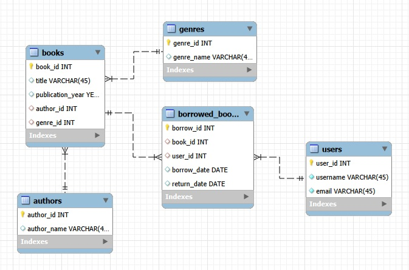

---

## 2. Заповнення таблиць тестовими даними

По два рядки в кожну таблицю.

Скрипт: [insert_data.sql](insert_data.sql)

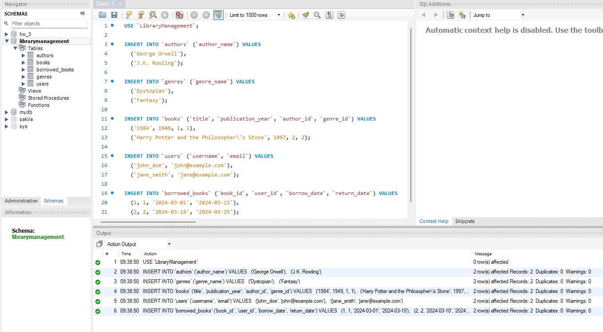

---

## 3. INNER JOIN — об'єднання всіх таблиць (hw-03)

Скрипт: [join_query.sql](join_query.sql)

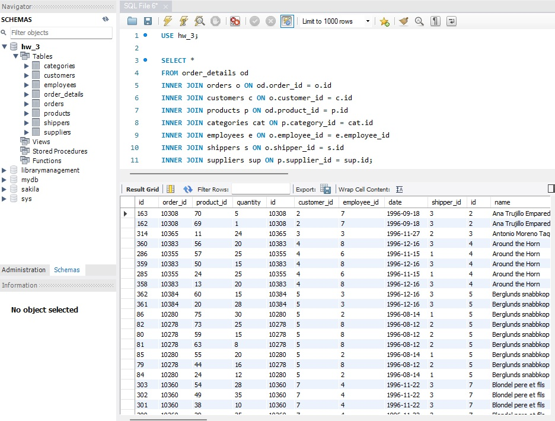

---

## 4. Складні запити

### 4.1 Кількість рядків (COUNT)

Скрипт: [4_1_count.sql](4_1_count.sql)

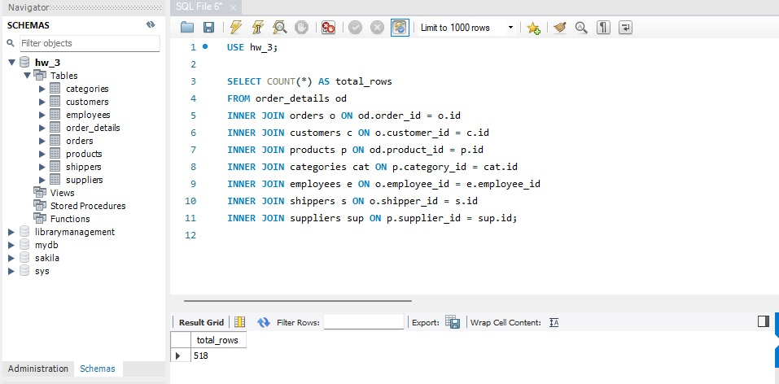

### 4.2 LEFT JOIN

LEFT JOIN повернув таку саму кількість рядків, що й INNER JOIN. Це означає, що
всі записи з лівої таблиці (`order_details`) мають відповідники в правих
таблицях — порожніх рядків з NULL не з'явилося.

Скрипт: [4_2_left_join.sql](4_2_left_join.sql)

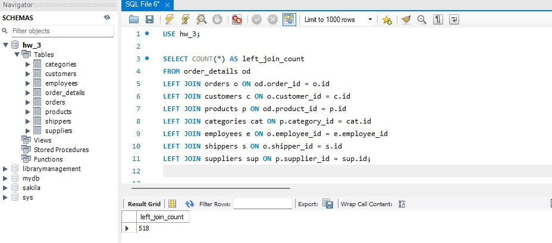

### 4.3 RIGHT JOIN

RIGHT JOIN із `order_details` як лівою таблицею змінює логіку вибірки: сервер
намагається повернути всі записи з правих таблиць і зіставити їх із
`order_details`. Це створює надмірно великий проміжний набір даних і може
призводити до timeout або результату, значно більшого за INNER JOIN.

Скрипт: [4_3_right_join.sql](4_3_right_join.sql)

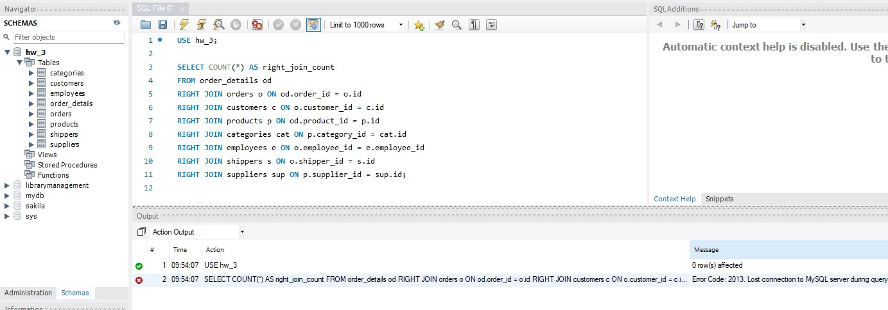

### 4.4 Фільтрація за employee_id

Вибрати лише рядки де `employee_id > 3` та `employee_id <= 10`.

Скрипт: [4_4_employee_filter.sql](4_4_employee_filter.sql)

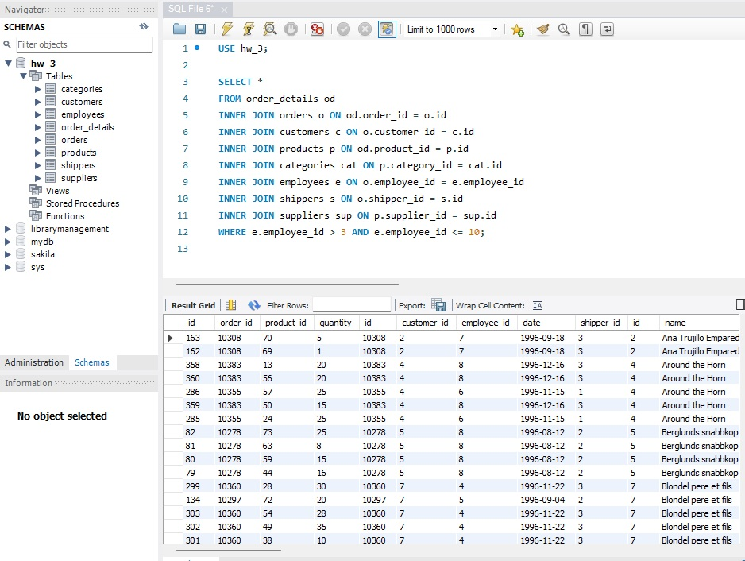

### 4.5 Групування за категорією

Кількість рядків у групі та середня кількість товару (`od.quantity`).

Скрипт: [4_5_group_by.sql](4_5_group_by.sql)

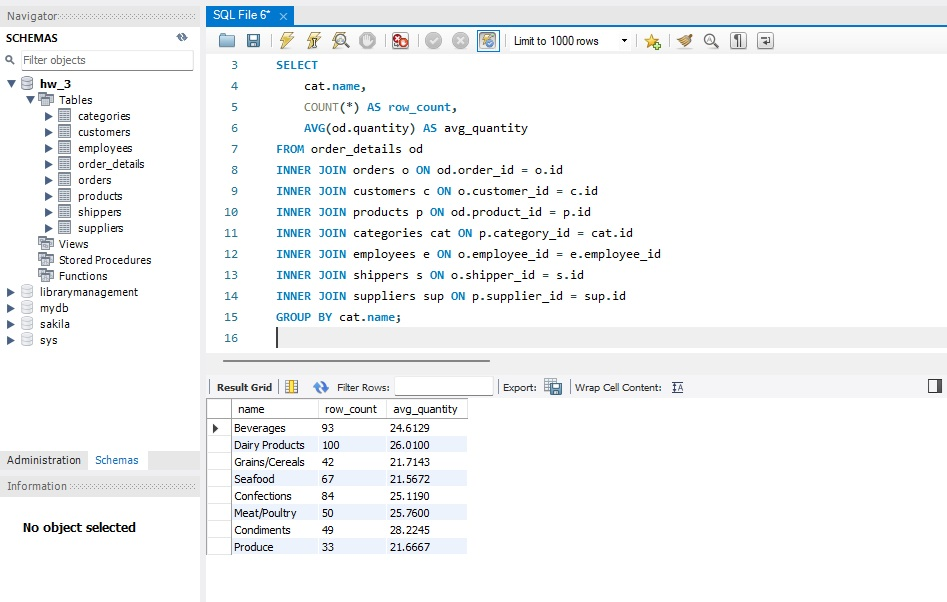

### 4.6 HAVING — фільтр груп

Залишити лише групи, де середня кількість товару більша за 21.

Скрипт: [4_6_having.sql](4_6_having.sql)

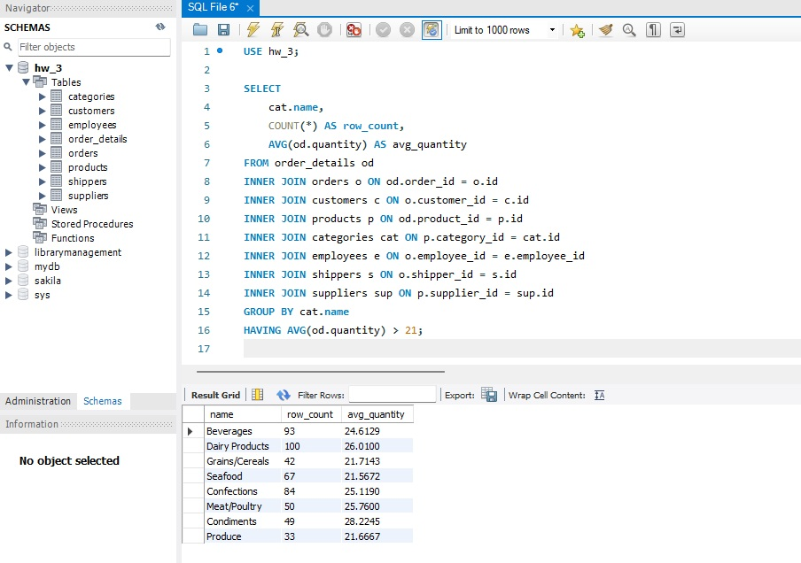

### 4.7 Сортування за спаданням

Відсортувати результат за спаданням кількості рядків у групі.

Скрипт: [4_7_order_by.sql](4_7_order_by.sql)

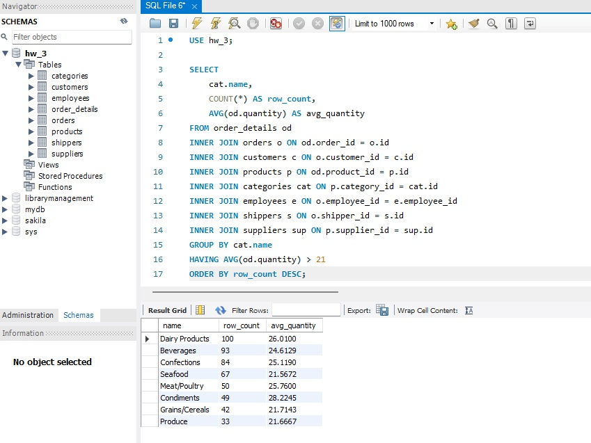

### 4.8 LIMIT з OFFSET

Вивести 4 рядки з пропущеним першим.

Скрипт: [4_8_limit_offset.sql](4_8_limit_offset.sql)

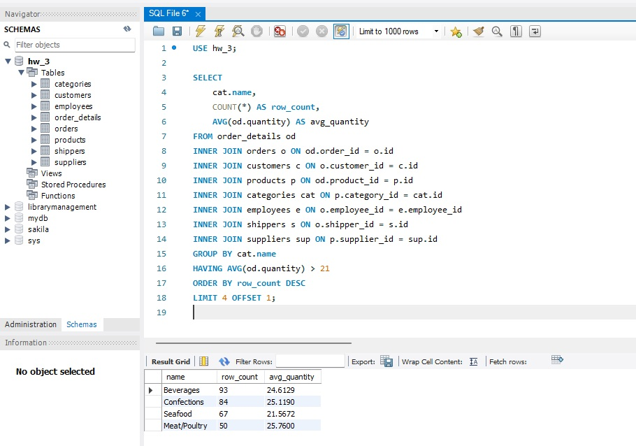
